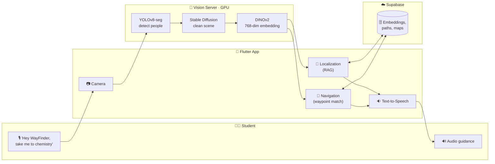

<div align="center">


# 🧭 WayFinder

### Giving blind students their independence back.

**AI-powered indoor navigation that needs no beacons, no floor-plan installs, and no infrastructure — just a phone camera.**

[](LICENSE)
[](https://flutter.dev)
[](https://python.org)
[](#)
[](#-csc-back-to-school-hackathon)

</div>

---

## ❤️ The Problem

> In every school, there are students who can't find their own classroom, cafeteria, or bathroom without asking for help. Not because they're lost — because they're **blind or visually impaired**.

Schools hand them a schedule and a hallway and expect them to navigate alone. But:

| Why today's tools fail indoors | |
|---|---|
| 🛰️ **GPS doesn't work indoors** | Signals can't reach through walls |
| 📡 **Beacons need infrastructure** | Schools don't have them installed |
| 🗺️ **Floor-plan apps assume sight** | A map you can't see doesn't help |
| 🙋 **So they depend on someone else** | Every single day, for every trip |

A student should not need a volunteer, a buddy, or a stranger to get to third period.

**WayFinder gives them back their independence.**

<div align="center">

### 🎯 Not "we built an indoor navigation app." We gave blind students their independence back.

</div>

---

## ✨ What WayFinder Does

A student opens WayFinder and says:

> **"Take me to my 3rd-period chemistry class."**

Using the phone's camera, **DINOv2 vision embeddings**, and **voice AI**, the app:

| | Capability | What the student experiences |
|---|---|---|
| 📍 | **Locates** exactly where the student is standing | "You are at the Main Entrance" |
| 🧭 | **Guides** them turn-by-turn through the school | "Continue straight, then turn left" |
| ⚠️ | **Warns** about obstacles in their path | "Caution: people ahead" |
| 🔔 | **Alerts** the teacher when they're arriving | Teacher gets a heads-up before the door opens |
| 🚨 | **Reroutes to the nearest exit** in an emergency | "Emergency — exit is 12 steps to your right" |

**No beacons. No special infrastructure. Just a phone.** 📱

---

## 🧩 The Three Layers of Framing

Lead with emotional. Support with practical. Close with technical.

| Layer | What we say | Why it matters |
|-------|-------------|----------------|
| ❤️ **Emotional** | *"Visually impaired students deserve the same independence as everyone else."* | Judges feel it |
| 🛠️ **Practical** | *"No beacons, no floor-plan installs, no infrastructure. Just a phone camera."* | Judges understand it |
| 🔬 **Technical** | *"DINOv2 embeddings + RAG localization + real-time waypoint matching + on-device obstacle detection."* | Judges respect it |

---

## 🏗️ How It Works



📐 **[Full architecture, sequence diagrams & component map →](docs/ARCHITECTURE.md)**

### 🔬 The Technical Story in Three Steps

| Step | Layer | Technology | Job |
|------|-------|-----------|-----|
| 1️⃣ | **Perception** | YOLOv8-seg + Stable Diffusion 2.0 + DINOv2 | See the scene, remove people, fingerprint it as a 768-dim vector |
| 2️⃣ | **Localization** | RAG retrieval + GPT-4 Vision | Match the fingerprint to a known location and verify it |
| 3️⃣ | **Guidance** | Waypoint matching + compass + dynamic thresholds | Walk the student in, turn by turn, and recover if they drift |

---

## 🎤 Voice-First by Design

Everything is hands-free — built for someone who cannot look at a screen.

| Command | Result |
|---------|--------|
| 🗣️ *"Hey WayFinder, where am I?"* | Captures 8 frames, cleans the scene, announces your location |
| 🗣️ *"Hey WayFinder, take me to the cafeteria"* | Orients you, then gives turn-by-turn directions |
| 🗣️ *"Hey WayFinder, what routes are available?"* | Lists nearby destinations |
| 🗣️ *"Hey WayFinder, why do you think I'm here?"* | Explains the evidence behind its location guess |
| 🗣️ *"Hey WayFinder, stop"* | Ends navigation immediately |

---

## 🛠️ Tech Stack

| Component | Technology | Purpose |
|-----------|-----------|---------|
| 📱 **Mobile App** | Flutter (Dart) | Cross-platform UI, TalkBack-friendly |
| 🧠 **Vision AI** | DINOv2 (Meta) | Scene understanding (768-dim embeddings) |
| 👤 **Object Detection** | YOLOv8-seg | People & carried-object detection |
| 🖌️ **Scene Cleaning** | Stable Diffusion 2.0 | Inpaint people out for robust matching |
| 🎙️ **Wake Word** | Porcupine | On-device "Hey WayFinder" |
| 🗣️ **Speech-to-Text** | Google STT | Transcribe voice commands |
| 💬 **NLU** | GPT-4 | Turn casual speech into intents |
| 👁️ **VLM Verification** | GPT-4 Vision | Confirm location matches |
| 🔊 **Audio Output** | Flutter TTS | Spoken guidance |
| ☁️ **Backend** | Supabase (PostgreSQL) | Database + auth + storage |
| ⚡ **AI Server** | FastAPI + PyTorch | GPU inference gateway |

---

## 🚀 Quick Start

### ✅ Prerequisites

| Need | Why |
|------|-----|
| 🤖 Android device (7.0+) with camera | Runs the app & speaks guidance |
| 🐍 Python 3.8+ with NVIDIA GPU | Runs the vision server |
| 🎯 Flutter 3.0+ | Builds the app |
| ☁️ Supabase account (free tier) | Database, auth, storage |
| 🔑 OpenAI API key | GPT-4 command parsing & location verification |

### 1️⃣ Set Up the Vision AI Server

```bash
cd scripts
pip install -r ../requirements.txt
wget https://github.com/ultralytics/assets/releases/download/v0.0.0/yolov8l-seg.pt
python dinov2_http_gateway.py     # http://YOUR_IP:8000
```

### 2️⃣ Set Up Supabase

Run `database_scheme.sql` in the Supabase SQL editor, then create the
`reference-images` and `maps` storage buckets.

### 3️⃣ Configure the App

Create a `.env` file:

```env
SUPABASE_URL=https://your-project.supabase.co
SUPABASE_ANON_KEY=your-anon-key
OPENAI_API_KEY=sk-your-api-key
```

Point the app at your server in `lib/services/dinov2_service.dart`:

```dart
static const String _defaultServerUrl = 'http://YOUR_SERVER_IP:8000';
```

### 4️⃣ Build & Run

```bash
flutter pub get
flutter run
```

---

## 📖 How to Use

### 🎓 For Students (Hands-Free)

1. Say **"Hey WayFinder, where am I?"** — the app tells you your location.
2. Say **"Hey WayFinder, take me to the cafeteria."**
3. Face the direction the compass tells you, then follow the spoken turns.

### 🛠️ For Teachers & Staff (Setup)

| Step | Action |
|------|--------|
| 1️⃣ | **Create a floor** — upload a floor-plan image |
| 2️⃣ | **Add locations** — tap the map to place nodes ("Cafeteria", "Chemistry Lab") |
| 3️⃣ | **Record a route** — walk it with the camera forward; the app captures waypoints every ~2s (embedding + heading + reference image) |

---

## 📊 Performance

| Metric | Clean scene | Crowded scene |
|--------|:-----------:|:-------------:|
| 🎯 Localization accuracy | **95%** | **90%** |
| 🧭 Waypoint detection | **92%** | — |
| 🔄 Recovery success | **85%** | — |
| ⚡ Navigation frame rate | 10–15 FPS | 10–15 FPS |

| Threshold | Value | Meaning |
|-----------|:-----:|---------|
| RAG retrieval | `0.80` | Embedding match to a location |
| Navigation — clean | `0.87` | Waypoint reached |
| Navigation — people present | `0.84` | Slightly loosened |
| Navigation — crowded | `0.75` | Loosened for crowds |
| Before a turn | `0.90` | High precision for turns |

---

## 🗄️ Data Model

| Table | Holds |
|-------|-------|
| `maps` | Floor-plan images |
| `map_nodes` | Named locations & their map position |
| `navigation_paths` | Recorded routes (start → end) |
| `path_waypoints` | Embedding + heading + turn type per waypoint |
| `place_embeddings` | 768-dim location fingerprints for RAG retrieval |

Full schema: [`database_scheme.sql`](database_scheme.sql)

---

## 🎛️ Configuration

**Tune matching strictness** — `lib/services/real_time_navigation_service.dart`:

```dart
static const double _waypointReachedThresholdDefault = 0.87; // standard
static const double _cleanSceneThreshold             = 0.87; // no people
static const double _peoplePresentThreshold          = 0.84; // 1-2 people
static const double _crowdedSceneThreshold           = 0.75; // 3+ people
static const double _turnWaypointThreshold           = 0.90; // before turns
```

**Server speed vs. quality**:

```bash
export SD_REALTIME_MODE=true    # faster, for live navigation
export SD_REALTIME_MODE=false   # higher quality inpainting
python dinov2_http_gateway.py
```

---

## 🏆 CSC Back-to-School Hackathon

<div align="center">

**Built for the [CSC Back-to-School Hackathon](https://csc-back-to-school.devpost.com)**
*Build something that helps students, teachers, or schools solve a real school-life problem.*

🗓️ **September 4 – October 5, 2026** · 🧑‍🎓 Beginner-friendly · 🌍 Open to students

</div>

### Why WayFinder fits the challenge

| Judging criterion | Our answer |
|-------------------|-----------|
| ❤️ **Impact** | Real accessibility problem — blind students navigating school alone every day |
| 💡 **Creativity** | Visual place recognition instead of beacons — non-generic, works with zero school infrastructure |
| 🎨 **Design** | Voice-first, TalkBack-friendly, hands-free; nothing requires sight |
| ⚙️ **Functionality** | Working localization + turn-by-turn navigation + auto-recovery demonstrated end-to-end |
| 📚 **Learning** | Team can explain every layer — from DINOv2 embeddings to RAG to dynamic thresholds |

### 🤖 AI-Use Disclosure

In line with the hackathon rules, we disclose how AI was used:

| Area | How AI helped |
|------|---------------|
| 🧠 **In the product** | DINOv2 (visual embeddings), GPT-4 (intent + verification), YOLOv8 (detection) — these *are* the product |
| 💻 **In development** | AI coding assistants (ChatGPT / Claude / OpenHands) were used to scaffold screens, debug, and draft documentation |
| ✅ **Our understanding** | The team designed the pipeline, tuned thresholds, recorded real paths, and can explain every component and decision |

### 📦 Submission Checklist

- [x] Project name & short description
- [x] Problem explanation & what it does
- [x] Source code (this repository)
- [x] MIT licensed & publicly viewable
- [x] Architecture documentation
- [ ] 🎥 1–2 minute demo video
- [ ] 🖼️ Screenshots
- [ ] 🔗 Devpost submission link

### 👥 Team

| Name | Role |
|------|------|
| **theyapguard** | Developer — app, vision pipeline, navigation |

---

## 🤝 Contributing

Contributions that expand independence are welcome!

| Area | Idea |
|------|------|
| 🍎 iOS support | Bring it to iPhone |
| 📴 Offline mode | On-device embeddings, no server |
| 🌐 Multi-language | Guidance in the student's language |
| 🚧 Obstacle detection | Richer, safer warnings |
| ⚡ Performance | Higher FPS on mid-range phones |

---

## 📄 License

Released under the **MIT License** — see [LICENSE](LICENSE).

---

<div align="center">

**WayFinder** — because getting to class shouldn't require asking for help. 🧭❤️

</div>
