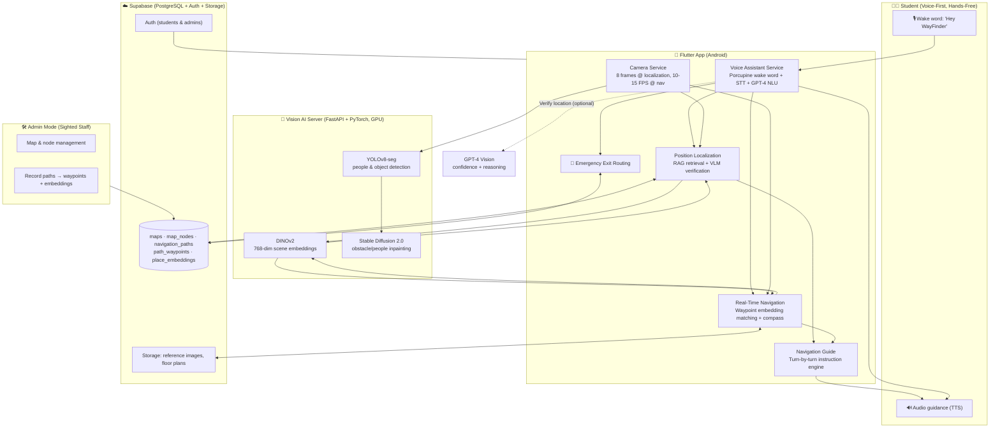
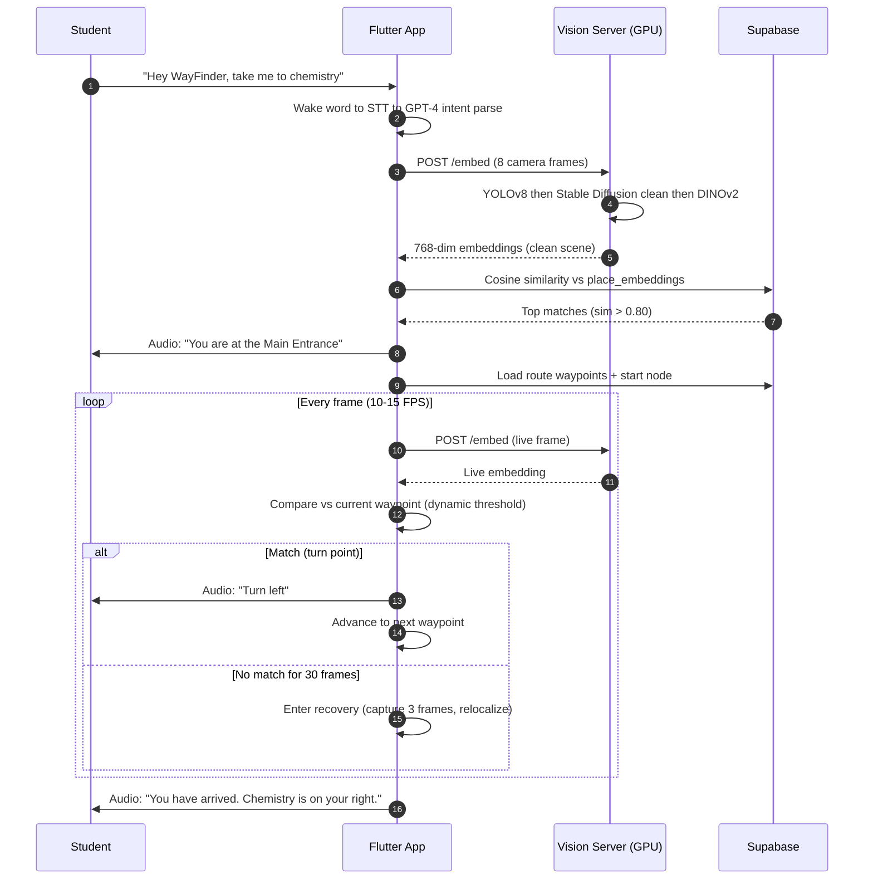

# WayFinder — System Architecture

WayFinder is a hands-free indoor navigation system for blind and visually impaired
students. This document explains how the pieces fit together and how a
voice request becomes turn-by-turn audio guidance.

## High-level Architecture

## Request Lifecycle

## The Three Layers of the System

### 1. Perception — "Where am I, and what's around me?"
- The camera captures frames; **YOLOv8-seg** finds people and carried objects.
- **Stable Diffusion 2.0** inpaints them out so a temporary crowd doesn't break matching.
- **DINOv2** turns the cleaned frame into a **768-dimensional embedding** — a compact,
  semantic fingerprint of the scene that is robust to lighting, angle, and time of day.

### 2. Localization — "Which classroom am I standing at?"
- **RAG (Retrieval-Augmented Generation)** over stored location embeddings:
  - **Retrieve:** cosine similarity search against `place_embeddings` (threshold > 0.80).
  - **Augment:** attach reference images and metadata for the top matches.
  - **Generate:** **GPT-4 Vision** verifies the candidate and returns confidence + reasoning.

### 3. Guidance — "How do I get to my class?"
- Recorded paths store **waypoints** (embedding + compass heading + turn type).
- During navigation the live embedding is compared to the current waypoint; when
  similarity crosses a **dynamic threshold** (0.87 clean, 0.75 crowded, 0.90 before turns),
  the waypoint instruction is spoken and the guide advances.
- A **compass** orients the student before movement starts. Loss of match for 30 frames
  triggers automatic recovery.

## Why It Works Without Infrastructure

| Traditional indoor navigation | WayFinder |
|-------------------------------|-----------|
| Bluetooth beacons installed per room | Not required — camera only |
| Precise floor-plan / Wi-Fi fingerprinting | Not required — recorded walk-through |
| Dedicated hardware for each student | Not required — any Android phone |
| GPS (doesn't work indoors) | Replaced by visual place recognition |

## Component Reference

| Layer | File(s) |
|-------|---------|
| Wake word & voice | `lib/services/voice_assistant_service.dart` |
| Localization (RAG) | `lib/services/position_localization_service.dart`, `lib/services/dinov2_service.dart` |
| Navigation loop | `lib/services/real_time_navigation_service.dart`, `lib/services/navigation_guide.dart` |
| Path recording | `lib/services/continuous_path_recorder.dart` |
| Backend / auth | `lib/services/supabase_service.dart` |
| Vision server | `scripts/dinov2_http_gateway.py` |
| Data model | `database_scheme.sql` |
